# Polyglot Codebase Knowledge Graph

> Generated offline by **readmenator**. Supports C, C++, Python, Go, Rust, JS/TS, Java, C#, Shell, PHP, Dart, GDScript, Nim, ASM.
> No LLMs. No tokens. Pure static analysis.

**Total Files Parsed:** 5 | **Total Symbols Extracted:** 7 | **Total Imports:** 9

## Structural Knowledge Map

```mermaid
graph TD
    classDef mod fill:#1e1e1e,stroke:#ff6666,stroke-width:2px,color:#fff;
    classDef cls fill:#2d2d2d,stroke:#4ec9b0,stroke-width:2px,color:#fff;
    classDef fn fill:#333,stroke:#dcdcaa,stroke-width:1px,color:#dcdcaa;
    classDef ext fill:#111,stroke:#666,stroke-dasharray: 5 5,color:#aaa;
    lima_h3_emuna_c["lima_h3_emuna.c (c)"]
    class lima_h3_emuna_c mod;
    lima_h3_emuna_c_emuna_show["emuna_show"]
    class lima_h3_emuna_c_emuna_show fn;
    lima_h3_emuna_c --> lima_h3_emuna_c_emuna_show
    lima_h3_emuna_c_emuna_store["emuna_store"]
    class lima_h3_emuna_c_emuna_store fn;
    lima_h3_emuna_c --> lima_h3_emuna_c_emuna_store
    lima_h3_emuna_c_emuna_init["emuna_init"]
    class lima_h3_emuna_c_emuna_init fn;
    lima_h3_emuna_c --> lima_h3_emuna_c_emuna_init
    lima_h3_emuna_c_emuna_exit["emuna_exit"]
    class lima_h3_emuna_c_emuna_exit fn;
    lima_h3_emuna_c --> lima_h3_emuna_c_emuna_exit
    lima_h3_emuna_c_DRIVER_NAME["DRIVER_NAME"]
    class lima_h3_emuna_c_DRIVER_NAME fn;
    lima_h3_emuna_c --> lima_h3_emuna_c_DRIVER_NAME
    patch_thermal_c["patch_thermal.c (c)"]
    class patch_thermal_c mod;
    patch_thermal_c_thermal_patch_init["thermal_patch_init"]
    class patch_thermal_c_thermal_patch_init fn;
    patch_thermal_c --> patch_thermal_c_thermal_patch_init
    app_py["app.py (py)"]
    class app_py mod;
    build_sh["build.sh (sh)"]
    class build_sh mod;
    install_sh["install.sh (sh)"]
    class install_sh mod;
    ext_linux_module_h["module.h"]
    class ext_linux_module_h ext;
    lima_h3_emuna_c -.->|imports| ext_linux_module_h
    ext_linux_kernel_h["kernel.h"]
    class ext_linux_kernel_h ext;
    lima_h3_emuna_c -.->|imports| ext_linux_kernel_h
    ext_linux_kallsyms_h["kallsyms.h"]
    class ext_linux_kallsyms_h ext;
    lima_h3_emuna_c -.->|imports| ext_linux_kallsyms_h
    ext_linux_sysfs_h["sysfs.h"]
    class ext_linux_sysfs_h ext;
    lima_h3_emuna_c -.->|imports| ext_linux_sysfs_h
    ext_linux_device_h["device.h"]
    class ext_linux_device_h ext;
    lima_h3_emuna_c -.->|imports| ext_linux_device_h
    ext_linux_platform_device_h["platform_device.h"]
    class ext_linux_platform_device_h ext;
    lima_h3_emuna_c -.->|imports| ext_linux_platform_device_h
    ext_linux_slab_h["slab.h"]
    class ext_linux_slab_h ext;
    lima_h3_emuna_c -.->|imports| ext_linux_slab_h
    patch_thermal_c -.->|imports| ext_linux_module_h
    patch_thermal_c -.->|imports| ext_linux_kernel_h
```

---

## Architecture Reference

### C (2 files)

#### `lima_h3_emuna.c`
**Path:** `lima_h3_emuna.c`

**Functions:**
- `emuna_show` (line 44) - *#define DRIVER_NAME "lima_h3_emuna" #define THERMAL_TABLE_SIZE 4  /* Original values found in mali.ko @ 0x194f4 static const u32 original_freqs[THE...*
- `emuna_store` (line 59)
- `emuna_init` (line 87) - *}  static DEVICE_ATTR_RW(emuna);  static struct attribute *emuna_attrs[] = { &dev_attr_emuna.attr, NULL };  static const struct attribute_group emu...*
- `emuna_exit` (line 124)

**Macros:**
- `DRIVER_NAME` (line 30)
- `THERMAL_TABLE_SIZE` (line 32)

#### `patch_thermal.c`
**Path:** `patch_thermal.c`

**Functions:**
- `thermal_patch_init` (line 6)

### PY (1 files)

#### `app.py`
**Path:** `app.py`

*No symbols extracted*

### SH (2 files)

#### `build.sh`
**Path:** `build.sh`

*No symbols extracted*

#### `install.sh`
**Path:** `install.sh`

*No symbols extracted*
