# Polyglot Codebase Knowledge Graph

> Generated offline by **readmenator**. Supports C, C++, Python, Go, Rust, JS/TS, Java, C#, Shell, PHP, Dart, GDScript, Nim, ASM, Ruby, Swift, Kotlin, Scala, Lua, Elixir.
> No LLMs. No tokens. Pure static analysis. See more [here](https://github.com/grisuno/ReadMenator)

**Total Files Parsed:** 4 | **Total Symbols Extracted:** 7 | **Total Imports:** 9

<!-- ranking_model: v1.0 | weights: {ppr:0.45,auth:0.2,test:0.15,doc:0.1,fresh:0.1} | alpha:0.85 | commit:75d209c | date:2026-07-18 -->


## Table of Contents

1. [Statistics Dashboard](#statistics-dashboard)
2. [Architectural Layers](#architectural-layers)
3. [Ranked Context](#ranked-context)
4. [God Nodes](#god-nodes)
5. [Suggested Questions](#suggested-questions)
6. [Hotspot Analysis](#hotspot-analysis)
7. [Change Impact Analysis](#change-impact-analysis)
8. [Suggested Linting Rules](#suggested-linting-rules)
9. [Orphans](#orphans)
10. [Query Recipes](#query-recipes)
11. [Structural Knowledge Map](#structural-knowledge-map)
12. [UML Class Diagram](#uml-class-diagram)
13. [Code Property Graph](#code-property-graph)
14. [Architecture Reference](#architecture-reference)
    - [C (2 files)](#c-2-files)
    - [PY (1 files)](#py-1-files)
    - [SH (1 files)](#sh-1-files)

---

## Statistics Dashboard

| Metric | Value |
|--------|-------|
| Total Files | 4 |
| Total Symbols | 7 |
| Total Imports | 9 |
| Call Edges | 0 |
| Inheritance Edges | 0 |
| Languages | 3 |
| Avg Symbols/File | 1.8 |
| Avg Imports/File | 2.2 |

### Top Files by Import Count (Fan-Out)

| File | Imports | Symbols | Language |
|------|---------|---------|----------|
| `lima_h3_emuna.c` | 7 | 6 | c |
| `patch_thermal.c` | 2 | 1 | c |

---

## Architectural Layers

Auto-detected from path patterns, naming conventions, and imported frameworks.

| Layer | Files |
|-------|-------|
| utility | 4 |

### utility

- `app.py` (py, 0 symbols)
- `install.sh` (sh, 0 symbols)
- `lima_h3_emuna.c` (c, 6 symbols)
- `patch_thermal.c` (c, 1 symbols)

---

## Ranked Context

Files ranked by composite score for the current query context. The ranking combines Personalized PageRank (query relevance), global authority, test coverage, documentation coverage, and code freshness. Model: v1.0.

| Rank | File | Composite | PPR | Authority | Test | Doc |
|------|------|-----------|-----|-----------|------|-----|
| 1 | `app.py` | 0.1000 | 0.0000 | 0.0000 | 0.00 | 1.00 |
| 2 | `patch_thermal.c` | 0.1000 | 0.0000 | 0.0000 | 0.00 | 1.00 |
| 3 | `lima_h3_emuna.c` | 0.0500 | 0.0000 | 0.0000 | 0.00 | 0.50 |
| 4 | `install.sh` | 0.0000 | 0.0000 | 0.0000 | 0.00 | 0.00 |

---

## God Nodes

Most architecturally central files ranked by combined import/export degree and symbol richness.

| File | Score | Connections | PageRank |
|------|-------|-------------|----------|
| `lima_h3_emuna.c` | 0.6 | | 0.0000 |
| `patch_thermal.c` | 0.1 | | 0.0000 |
| `app.py` | 0.0 | | 0.0000 |
| `install.sh` | 0.0 | | 0.0000 |

---

## Suggested Questions

Auto-generated exploration prompts based on graph structure:

- What does lima_h3_emuna.c depend on, and what depends on it? (0 connections)
- What does patch_thermal.c depend on, and what depends on it? (0 connections)
- What does app.py depend on, and what depends on it? (0 connections)
- What is the overall architecture of this codebase?

---

## Hotspot Analysis

Files ranked by combined complexity (symbol count) and centrality (connection count). High-scoring files are architecturally critical and may need refactoring attention.

| File | Complexity | Centrality | Combined | Symbols | Connections |
|------|-----------|------------|----------|---------|-------------|
| `app.py` | 0.000 | 0.000 | 0.000 | 0 | 0 |
| `patch_thermal.c` | 0.167 | 0.286 | 0.238 | 1 | 2 |
| `lima_h3_emuna.c` | 1.000 | 1.000 | 1.000 | 6 | 7 |
| `install.sh` | 0.000 | 0.000 | 0.000 | 0 | 0 |

---

## Change Impact Analysis

Files sorted by how many other files would be affected if they changed. High-impact files should be changed with caution.

| File | Direct Dependents | Transitive Dependents | Total Impact |
|------|------------------|----------------------|--------------|
| `app.py` | 0 | 0 | 0 |
| `install.sh` | 0 | 0 | 0 |
| `lima_h3_emuna.c` | 0 | 0 | 0 |
| `patch_thermal.c` | 0 | 0 | 0 |

---

## Suggested Linting Rules

Automatically suggested linting and security rules based on patterns detected in the codebase. These can be exported as Semgrep rules using the `--export-rules` flag.

| Rule ID | Severity | Description | Language | Matches |
|---------|----------|-------------|----------|---------|
| `RM001` | info | Large number of functions in c: 5 total | c | 5 |

---

## Orphans

Files with no documentation or low connectivity. These are candidates for documentation investment or cleanup.

- `install.sh` (0 symbols, no doc)

---

## Query Recipes

Example queries you can run against this knowledge base using the ranking engine:

```
# Find files most relevant to a concept
readmenator query "Where is the import resolver implemented?"

# Rank files by relevance to a topic
readmenator query "How does documentation generation work?"

# Explain why a file ranks highly
readmenator query "explain readmenator/_documentation.py"

# Trace dependency paths with ranked context
readmenator query "path from CLI to exporter"
```

The ranking model uses the following signals:

- **Personalized PageRank** (45% weight): query-specific relevance via seed propagation
- **Global Authority** (20% weight): structural importance via standard PageRank
- **Test Coverage** (15% weight): fraction of symbols referenced in test files
- **Doc Coverage** (10% weight): presence of docstrings and file-level docs
- **Freshness** (10% weight): recent modification activity

Results include score decomposition and justification paths for each ranked item.

---

## Structural Knowledge Map

```mermaid
graph TD
    classDef mod fill:#1e1e1e,stroke:#ff6666,stroke-width:2px,color:#fff;
    classDef cls fill:#2d2d2d,stroke:#4ec9b0,stroke-width:2px,color:#fff;
    classDef fn fill:#333,stroke:#dcdcaa,stroke-width:1px,color:#dcdcaa;
    classDef ext fill:#111,stroke:#666,stroke-dasharray:5 5,color:#aaa;
    lima_h3_emuna_c["lima_h3_emuna.c (c)"]
    class lima_h3_emuna_c mod;
    lima_h3_emuna_c_emuna_show["emuna_show"]
    class lima_h3_emuna_c_emuna_show fn;
    lima_h3_emuna_c --> lima_h3_emuna_c_emuna_show
    lima_h3_emuna_c_emuna_store["emuna_store"]
    class lima_h3_emuna_c_emuna_store fn;
    lima_h3_emuna_c --> lima_h3_emuna_c_emuna_store
    lima_h3_emuna_c_emuna_init["emuna_init"]
    class lima_h3_emuna_c_emuna_init fn;
    lima_h3_emuna_c --> lima_h3_emuna_c_emuna_init
    lima_h3_emuna_c_emuna_exit["emuna_exit"]
    class lima_h3_emuna_c_emuna_exit fn;
    lima_h3_emuna_c --> lima_h3_emuna_c_emuna_exit
    lima_h3_emuna_c_DRIVER_NAME["DRIVER_NAME"]
    class lima_h3_emuna_c_DRIVER_NAME fn;
    lima_h3_emuna_c --> lima_h3_emuna_c_DRIVER_NAME
    patch_thermal_c["patch_thermal.c (c)"]
    class patch_thermal_c mod;
    app_py["app.py (py)"]
    class app_py mod;
    install_sh["install.sh (sh)"]
    class install_sh mod;
    ext_linux_module_h["module.h"]
    class ext_linux_module_h ext;
    lima_h3_emuna_c -.->|imports| ext_linux_module_h
    ext_linux_kernel_h["kernel.h"]
    class ext_linux_kernel_h ext;
    lima_h3_emuna_c -.->|imports| ext_linux_kernel_h
    ext_linux_kallsyms_h["kallsyms.h"]
    class ext_linux_kallsyms_h ext;
    lima_h3_emuna_c -.->|imports| ext_linux_kallsyms_h
    ext_linux_sysfs_h["sysfs.h"]
    class ext_linux_sysfs_h ext;
    lima_h3_emuna_c -.->|imports| ext_linux_sysfs_h
    ext_linux_device_h["device.h"]
    class ext_linux_device_h ext;
    lima_h3_emuna_c -.->|imports| ext_linux_device_h
    ext_linux_platform_device_h["platform_device.h"]
    class ext_linux_platform_device_h ext;
    lima_h3_emuna_c -.->|imports| ext_linux_platform_device_h
    ext_linux_slab_h["slab.h"]
    class ext_linux_slab_h ext;
    lima_h3_emuna_c -.->|imports| ext_linux_slab_h
    patch_thermal_c -.->|imports| ext_linux_module_h
    patch_thermal_c -.->|imports| ext_linux_kernel_h
```



---

## Code Property Graph

Machine-readable Code Property Graph (CPG) in JSON-LD format. This block allows AI agents to parse the full structural graph without additional file reads. Compatible with GraphRAG pipelines.

```json
{"@context": "https://schema.org", "analysis": {"communities": [], "god_nodes": [{"node_id": "lima_h3_emuna.c", "score": 0.6}, {"node_id": "patch_thermal.c", "score": 0.1}, {"node_id": "app.py", "score": 0.0}, {"node_id": "install.sh", "score": 0.0}], "surprising_connections": []}, "edges": [{"confidence": "EXTRACTED", "relation": "imports", "source": "lima_h3_emuna.c", "target": "linux/module.h"}, {"confidence": "EXTRACTED", "relation": "imports", "source": "lima_h3_emuna.c", "target": "linux/kernel.h"}, {"confidence": "EXTRACTED", "relation": "imports", "source": "lima_h3_emuna.c", "target": "linux/kallsyms.h"}, {"confidence": "EXTRACTED", "relation": "imports", "source": "lima_h3_emuna.c", "target": "linux/sysfs.h"}, {"confidence": "EXTRACTED", "relation": "imports", "source": "lima_h3_emuna.c", "target": "linux/device.h"}, {"confidence": "EXTRACTED", "relation": "imports", "source": "lima_h3_emuna.c", "target": "linux/platform_device.h"}, {"confidence": "EXTRACTED", "relation": "imports", "source": "lima_h3_emuna.c", "target": "linux/slab.h"}, {"confidence": "EXTRACTED", "relation": "imports", "source": "patch_thermal.c", "target": "linux/module.h"}, {"confidence": "EXTRACTED", "relation": "imports", "source": "patch_thermal.c", "target": "linux/kernel.h"}], "generator": "readmenator", "metadata": {"edge_count": 9, "file_count": 4, "language_count": 3, "symbol_count": 7}, "nodes": [{"doc": "_*_ coding: utf8 _*_", "id": "app.py", "kind": "module", "label": "app.py", "language": "py", "sha256": "57b21bdb023585b8", "symbol_count": 0, "symbols": []}, {"id": "install.sh", "kind": "module", "label": "install.sh", "language": "sh", "sha256": "c907d80fd6734993", "symbol_count": 0, "symbols": []}, {"doc": "SPDX-License-Identifier: GPL-2.0-or-later", "id": "lima_h3_emuna.c", "kind": "module", "label": "lima_h3_emuna.c", "language": "c", "sha256": "6301ed1bd6bc9cee", "symbol_count": 6, "symbols": [{"doc": "#define DRIVER_NAME \"lima_h3_emuna\" #define THERMAL_TABLE_SIZE 4 /* Original values found in mali.ko @ 0x194f4 static const u32 original_freqs[THERMAL_TABLE_SIZE] = {576, 432, 312, 120}; /* Emuna values: never below 200 MHz static const u32 emuna_freqs[THERMAL_TABLE_SIZE]     = {400, 350, 280, 200}; static u32 *thermal_table_ptr = NULL; static u32  backup_table[THERMAL_TABLE_SIZE]; /* ========== SYSFS: Live Tuning ==========", "kind": "function", "line": 44, "name": "emuna_show", "signature": "static ssize_t emuna_show(struct device *dev,\n                          struct device_attribute *..."}, {"kind": "function", "line": 59, "name": "emuna_store", "signature": "static ssize_t emuna_store(struct device *dev,\n                           struct device_attribute..."}, {"doc": "} static DEVICE_ATTR_RW(emuna); static struct attribute *emuna_attrs[] = { &dev_attr_emuna.attr, NULL }; static const struct attribute_group emuna_group = { .attrs = emuna_attrs, }; /* ========== Core Logic ==========", "kind": "function", "line": 87, "name": "emuna_init", "signature": "static int __init emuna_init(void)"}, {"kind": "function", "line": 124, "name": "emuna_exit", "signature": "static void __exit emuna_exit(void)"}, {"kind": "macro", "line": 30, "name": "DRIVER_NAME"}, {"kind": "macro", "line": 32, "name": "THERMAL_TABLE_SIZE"}]}, {"doc": "include <linux/module.h> include <linux/kernel.h>  Parchear thermal_ctrl_freq en la dirección 0x294e4", "id": "patch_thermal.c", "kind": "module", "label": "patch_thermal.c", "language": "c", "sha256": "939443add8cc3c13", "symbol_count": 1, "symbols": [{"kind": "function", "line": 6, "name": "thermal_patch_init", "signature": "static int __init thermal_patch_init(void)"}]}], "type": "CodePropertyGraph", "version": "1.0"}
```

---

## Architecture Reference

### C (2 files)

#### `lima_h3_emuna.c`
**Path:** `lima_h3_emuna.c`
**File Doc:** *SPDX-License-Identifier: GPL-2.0-or-later*

**Functions:**
- `emuna_show` (line 44) `static ssize_t emuna_show(struct device *dev,
                          struct device_attribute *...` - *#define DRIVER_NAME "lima_h3_emuna" #define THERMAL_TABLE_SIZE 4 /* Original values found in mali.ko @ 0x194f4 static const u32 original_freqs[THERMAL_TABLE_SIZE] = {576, 432, 312, 120}; /* Emuna values: never below 200 MHz static const u32 emuna_freqs[THERMAL_TABLE_SIZE]     = {400, 350, 280, 200}; static u32 *thermal_table_ptr = NULL; static u32  backup_table[THERMAL_TABLE_SIZE]; /* ========== SYSFS: Live Tuning ==========*
- `emuna_store` (line 59) `static ssize_t emuna_store(struct device *dev,
                           struct device_attribute...`
- `emuna_init` (line 87) `static int __init emuna_init(void)` - *} static DEVICE_ATTR_RW(emuna); static struct attribute *emuna_attrs[] = { &dev_attr_emuna.attr, NULL }; static const struct attribute_group emuna_group = { .attrs = emuna_attrs, }; /* ========== Core Logic ==========*
- `emuna_exit` (line 124) `static void __exit emuna_exit(void)`

**Macros:**
- `DRIVER_NAME` (line 30)
- `THERMAL_TABLE_SIZE` (line 32)

#### `patch_thermal.c`
**Path:** `patch_thermal.c`
**File Doc:** *include <linux/module.h> include <linux/kernel.h>  Parchear thermal_ctrl_freq en la dirección 0x294e4*

**Functions:**
- `thermal_patch_init` (line 6) `static int __init thermal_patch_init(void)`

### PY (1 files)

#### `app.py`
**Path:** `app.py`
**File Doc:** *_*_ coding: utf8 _*_*

*No symbols extracted*

### SH (1 files)

#### `install.sh`
**Path:** `install.sh`

*No symbols extracted*
